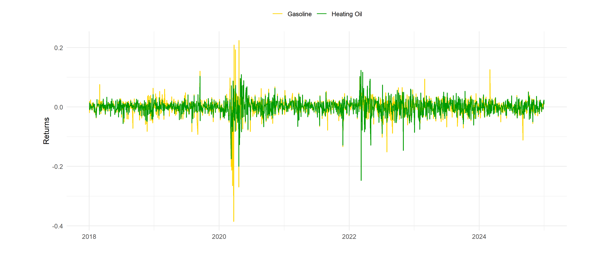

```{r setup, include=FALSE}
knitr::opts_chunk$set(echo = FALSE, warning = FALSE, message = FALSE, 
                      fig.align = 'center', out.width = '100%')
```
\newpage

# Project Overview

This project serves as an educational exploration into quantitative trading strategies, specifically examining pairs trading in commodity futures markets. We selected gasoline (RBOB) and heating oil (HO) futures traded on the New York Mercantile Exchange (NYMEX) as our trading pair to apply time series analysis techniques and identify potential trading opportunities based on mean reversion.

## Why Energy Commodities?

Energy markets offer an ideal learning environment for pairs trading for several reasons:

**Correlation**: Gasoline and heating oil are both refined from crude oil in the same refineries, creating a natural relationship. They have a **similar supply** (refinery shutdowns, crude oil price movements) and face the same refining constraints. These connections create a persistent correlation that makes temporary price diversions, perfect for mean-reversion strategies.

**Acceptable Volatility with Structural Stability**: While energy prices fluctuate significantly, the underlying relationship between refined products remains relatively stable over long periods (the same amount of oil and heating will likely be needed in the future). This balance allows us to observe powerful enough signals without the instability that would make the strategy impractical or purely speculative.

**Data Accessibility**: Historical futures **data for these contracts is readily available** through platforms like Yahoo Finance, making this analysis easy and good to implement what we have learned so far, without requiring expensive data subscriptions to other market-ready APIs.

By studying this pair, we aim to get exposure to key quantitative finance concepts: **stationarity** testing, **cointegration** analysis, **mean reversion** modeling, and risk management. 

## Data Acquisition

From **yahoo finance** (library - _quantmod_) We pulled daily closing prices of futures contracts traded for the benchmark for wholesale **Gasoline**, or Reformulated Blendstock for Oxygenate Blending (_NYMEX_: RB = F), and **Heating Oil**, a distillate fuel used for heating purposes (_NYMEX_: HO = F), going as far back as 2000. 

## Preprocessing

- **N/A Handling**: Fill missing values with the mean of the previous 7 days.

- **Data Parity**:  Transformed daily _closing prices_ to logarithmic scale, to compare "apples to apples".

- **Daily returns** : Log returns calculated.

\begin{center}
\textbf{Key Finding: Correlation of returns = +70\%}
\end{center}
```{r fuel-prices, fig.cap="Normalized RBOB and HO Prices (Rebased at 100)",fig.align = 'center', out.width = '90%', fig.pos='H'}
knitr::include_graphics("data_acquisition/fuel_prices_plot.png")
```


## Time Series Modelling 

### Stationarity check:

Before implementing any time series model, we must verify that our data is suitable for modeling. The **Augmented Dickey-Fuller** (ADF) test checks for **stationarity**: whether a series fluctuates around a constant mean without trending upward or downward over time. Non-stationary prices are typical for financial assets (also known as _random walks_), while stationary returns indicate predictable series that tend to return to a mean.

So, we are aiming for **_stationary returns_** (I(0)) but **_non-stationary prices_** (I(1)).


We apply the ADF test to both log-prices and returns for gasoline and heating oil:
```{r adf-code-example, eval=FALSE, echo=TRUE}
# ADF test on log prices
adf.test(log_prices$Gasoline)
adf.test(log_prices$HO)

# ADF test on returns
adf.test(returns$Gasoline)
adf.test(returns$HO)
```
For both gasoline and heating oil log-prices, the ADF p-values is bigger than the conf interval (0.05), so we **cannot reject the null hypothesis** (ie, the series is a random walk, what we want in a financial series).

```{r returns, fig.cap="Daily Log Returns (2018 onwards)",fig.align = 'center', out.width = '90%', fig.pos='H'}

```

For log-returns however, **ADF p-values are below 0.05**, indicating stationarity (I(0)). So, non-stational prices and stational returns require then a **cointegration testing**.

### Cointegration 

Pairs trading is all about **assuming our variables move together over time**. To check this, we perform an _Engle-Granger_ two-step process, that is both easy and powerful for pairs of variables. If they indeed move together, the **spread** (residuals of the model) should move around a long-term average.

If gasoline's and heating oil's closing prices move together over time, we should find the following from the model:

- **(intercept)**: the base difference between the stocks.

- **(slope)**: equilibrium hedge ratio ~ **_How much does HO move when RBOB moves_**.

- **R² (fit quality)**: not used for cointegration.

- **Residuals**: the spread (actual price - predicted price).
```{r engle-granger-table, echo=FALSE}
# Load pre-calculated Engle-Granger results
eg_results_table <- readRDS("data_analysis/eg_results_table.rds")

knitr::kable(eg_results_table, 
             caption = "Engle-Granger Cointegration Test Results",
             align = c('c', 'c', 'c'))
```
```{r eg-interpretation, echo=FALSE, results='asis'}
# Load individual values for inline text
eg_values <- readRDS("data_analysis/eg_values.rds")

cat(sprintf("**Interpretation**: The ADF test on the spread residuals yields a p-value of 0.01, indicating **cointegration** between RBOB gasoline and heating oil. The hedge ratio (β) of 1.0613 represents the long-run equilibrium relationship: when RBOB log-prices increase by 1 unit, HO log-prices tend to increase by approximately 1.06 units. This ~1:1 relationship **confirms the correlation** between these two commodities.
",
            eg_values$adf_pvalue,
            ifelse(eg_values$cointegrated, "**significant cointegration**", "no cointegration"),
            eg_values$beta,
            eg_values$beta * 100))
```


### AR(1) Model on the Spread

\begin{center}
\textbf{$\phi$ (AR1) = 0.9851}
\end{center}

The spread is mean-reverting, because **|phi| < 1**, but it is not extremely fast (phi close to 1 → slower reversion). In comparison to equities that have a faster correction, **commodities tend to revert slower**.

### Half-Life of Mean Reversion

An important metric is **half-life**, that calculated how long does the spread take to move halfway back to its long-run mean.

\begin{center}
\textbf{Half-life = 46.1 days}
\end{center}

If the spread widens today, it takes ~46 trading days. Commodities usually follow longer cycles of supply and demand and suffer less volatility than equities. Nevertheless, this is **longer in comparison to equities**, which typically have half-lives of 5–20 days.

## Trading Strategy 

Once we have calculated our spread and checked the existence of a relationship between gasoline and heating oil, we need to start setting windows to compare if in recent times the market has been bearish or too excited against its historical.

Starting with the rolling window, we must have enough history to trust our rolling mean and z value. The quantitative finance literature ( Pole (2007), Gatev et al. (2006)) indicates that a good rule of thumb for the rolling window: "_should be half life x 1.5_". Therefore, with a half life of ~46 days, we set our rolling window for the previous **60 days**.

For each day in the dataset, we calculate the **mean spread**,  and the **volatility** (standard deviation). Then, our Z score is no more than the coeff of how many standard deviations away from the mean my current spread is.

By calculating the **z score** (~how unlikely is the point observed from the mean given the volatility) will tell me if the spread is **abnormally high or low**.

If the spread is high, Gasoline is overpriced vs Heating Oil.
If the spread is low, Gasoline is cheap vs Heating Oil.

### Building the signals

In order for an algorithm to operate, it needs rules to know when and how to trade. This is the concept of signals: on our case, a signal is simply an instruction to buy, sell, or hold a position. We use the z-score to build our signals as follows:

- **+1** → open / keep a long spread position. Buy gasoline and sell HO when the spread is abnormally low

- **–1** → open / keep a short spread position. Sell gasoline and buy HO when the spread is abnormally high

- **0** → close position (stay flat) When the spread returns to normal, the trade must be closed.

Note: This model is trained to *only* hold one trade at a time. Therefore, if a signal is already active (long or short), the model will ignore any new signal until the position is closed (signal = 0).

### P&L Calculation

Our model is worth the amount of money it can make. Therefore, we need to calculate the profit and loss (P&L) of our strategy. We have three metrics to evaluate it:

- **Annualized return**: **13.5%** 

    This is assuming the model is operating continuously with no interruptions, no delays, and reinvested profits.
    For a market-neutral (long–short) strategy that does not depend on market direction, **this is a solid result considering annualized result of major indices** roams around 10-12% during the same period

- **Annualized volatility**: **25.0%**

    The standard deviation of the returns per year.


- **Sharpe Ratio**: 0.537

  By far, the most important metric for evaluating a trading strategy. It is calculated as the ratio of annualized return to annualized volatility (return per unit of risk). Esentially, the **risk-adjusted return of the strategy**.
  
  For a market-neutral (long–short) strategy that does not depend on market direction, this is a solid result in terms of returns. However, it requires **risk management improvements** to be practical in a real-world setting. 

### Stop-Loss integration

To further improve our strategy, we implement  some **stop-loss** mechanics to limit the downside risk.

A stop-loss triggers an order to automatically sell (or buy, depending on the position) a stock when its price reaches a predetermined price (or percentage loss), helping to limit potential losses by exiting the trade before further losses may occur.

In our implementation, the stop-loss is **integrated directly into the signal generation** loop using z-score thresholds of +3 and -3, which represent extreme deviations (approximately 99.7% confidence interval under a normal distribution, assuming the spread is roughly Gaussian). Specifically:

- For a **long spread position** (signal = 1, where we've bought Gasoline and sold Heating Oil expecting the spread to increase): If the z-score drops below -3 (indicating the spread has        narrowed adversely even further, against our bet), the stop-loss triggers an immediate exit by setting the signal to 0, closing the position to prevent deeper losses.
  
-  For a **short spread position** (signal = -1, where we've sold Gasoline and bought Heating Oil expecting the spread to decrease): If the z-score rises above +3 (indicating the spread has      widened adversely, against our bet), the stop-loss similarly forces an exit to 0.

This mechanism is checked daily alongside the normal exit conditions (e.g., when |z| < 0.5). By using z-scores tied to the rolling spread volatility, the stop-loss adapts to changing market conditions rather than a fixed price, making it more robust for commodities like these. In backtesting, it helps reduce maximum drawdowns, though it may occasionally cut short recovering trades if volatility spikes.


## Conclusion

**Backtesting** on data from the year 2000 gave decent results: **13.5% annualized return**, 25% volatility, and a Sharpe ratio of 0.537. That's pretty good for a market-neutral setup, beating average stock market returns (like 10-12% for the S&P) without relying on overall trends. We added a basic stop-loss at ±3 z-scores to cut losses, but it might close winning trades too early sometimes.

After reasearching for this project, we have learned a lot about how to handle time series and explore new trading strategies for our personal Investments. It feels as if a proffesionalized trading strategy is not so foreign now. We also have learned about the energy-markets and gained a broather understanding of the underlying dependencies between commodities. Still, it is surprising how something as important as energy prices can be fiddled with relatively simple statistical tools.

